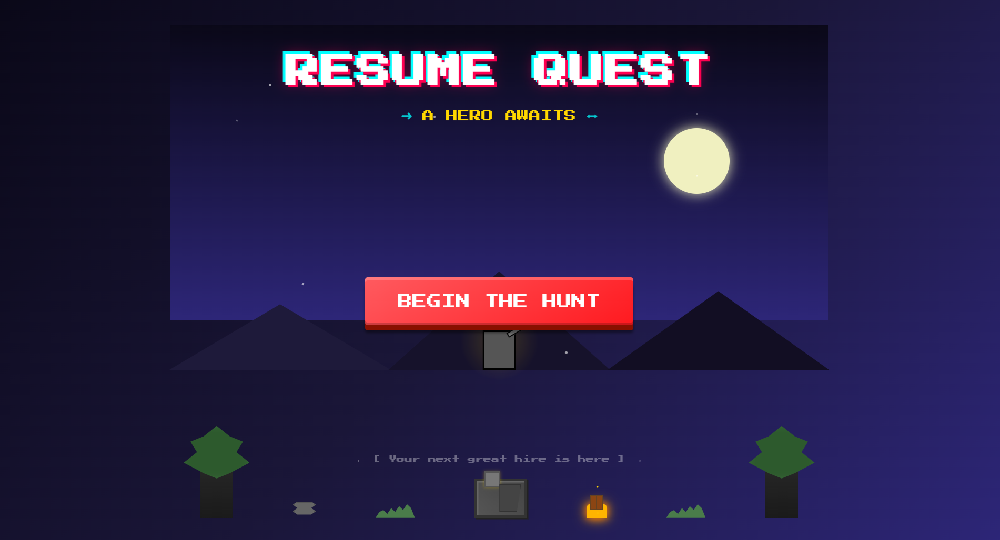

# Resume Quest: A Hero Awaits 🦸



Think of it like Super Mario meets LinkedIn - you jump around collecting "skill orbs" while discovering what I can do.

---

## 🎮 What You Do:
- **Walk and Explore** - through different beautiful worlds
- **Jump on platforms** - (don't worry about falling - you'll respawn!)
- **Collect the skill orbs** - to unlock my skills
- **Read signposts** - to learn more about my experience
- **Find the treasure chest** - at the end to see my full resume

---

## 🌄 The Magical Worlds You'll Explore

| Region       | Start | End   | What You'll See                           |   Difficulty   |
|--------------|-------|-------|-------------------------------------------|----------------|
| Mountain     | 0     | 3000  | Basic terrain, Mountain, Trees 🌲         |    ★☆☆☆☆    |
| Snow         | 1000  | 6200  | Igloos, Snowmen, Snow House ☃️            |    ★★☆☆☆    |
| Volcanic     | 5500  | 10500 | Crystals, Floating Rock Ring, Prison 🌋   |    ★★★★★    |
| Cyberpunk    | 9000  | 15000 | Buildings, Elevators, High-tech vibes 🌆  |    ★★★★☆    |
| Industrial   | 13000 | 18000 | Factories, Railway, Machinery zones 🏭    |    ★★★☆☆    |
| Golden Cave  | 16000 | 20700 | Treasure, Ruins, Mystical elements 🪙     |    ★★☆☆☆    |

---

## 💡 Why This Is Different From Regular Resumes
| Traditional Resume	   | This Game Resume              |
|--------------------------|-------------------------------|
| 📄 Paper or PDF	      | 🎮 Interactive experience     |
| ❌ Boring to read	     | ✅ Fun to explore             |
| 🔍 Hard to stand out	  | 🌟 Memorable and unique       |
| 📏 One-size-fits-all	  | 🎯 Personalized journey       |

---

## 🕐 How Long Does It Take?

Complete your adventure in:
- ⏱️ **5-10 minutes** if you want to quickly see everything
- 🕑 **15-20 minutes** if you want to explore thoroughly
- ⏳ Or take as long as you want - **no rush!**

---

## ✨ Features
- 🎯 **Skill Collection System** – Skill Orbs to reveal professional skills and achievements
- 🏆 **Progressive Unlocks** – Background evolves as you collect more skills  
- 🎨 **Pixel-Perfect Visuals** – Hand-coded environments with animated elements  
- 🎵 **Immersive Audio** – Region-based background music + sound effects  
- 📱 **Mobile Friendly** – Touch controls with vibration feedback
- 💼 **Resume Integration** – The Ultimate **pdf document**

---

## 🎯 How to Play

### On Desktop:
- `← →` / `A D` – Move left/right  
- `Space` / `↑` – Jump (with **wall jump**)  
- Jump near signs – Interact with **information points**  

### On Mobile:
- On-screen arrows – Move and jump  
- **Haptic feedback** on jump  

---

## 🛠️ Technical Implementation

### Architecture:
- **React-based** with hooks for state management  
- **Canvas rendering** for performance 
- Custom **physics** with collision detection  
- Modular design for **easy expansion**

### Key Components:
- `GameCanvas` – Main game component with game loop  
- `ModalInfo` – Interactive information displays  
- `ResumeModal` – Full resume modal  
- Custom **drawing modules** for environments + objects  

### Performance Features:
- Debounced **resize handling**  
- Throttled **audio playback**  
- **Efficient rendering** – only redraw when needed  
- **Region-based drawing** – render only what’s visible  

---

## 🏆 The Unfair Advantage
 
This game is designed to be stress-free. Imagine a world where you're a god. That is how it is:

✅ No time limits
✅ No enemies to fight
✅ No game over screens
✅ Truly Infinite lives
✅ Play at your own pace

---

## 🎨 Customization

### Adding New Regions:
1. Update `REGION_BOUNDARIES` constant  
2. Create drawing function in module  
3. Add case to region switch in `drawGame`  

### Adding New Skills:
- Add entry to `ORBS` array with `label`, `content`, and `position`  
- Skill automatically appears in **progress tracker**  

### Modifying Physics:
Adjust constants:  
```js
GRAVITY      // Fall speed acceleration  
FRICTION     // Ground movement resistance  
PLAYER_SPEED // Horizontal movement speed  
JUMP_FORCE   // Jump height
```

---

## 📦 Installation

```bash
# Clone the repository
git clone <your-repo>

# Install dependencies
npm install
yarn install

# Remove package-lock json
❌ package-lock.json
✅ yarn lock

# Start development server
yarn start
```

---

## 🌟 Special Features
- **Coyote Time** – Grace period for jumps after leaving platforms  
- **Jump Buffering** – Input forgiveness for smoother play  
- **Wall Jumping** – Extra mobility  
- **Dynamic Difficulty** – Environment evolves with progress  
- **Interactive Elements** – Conveyor belts, elevators, moving platforms  

---

## 🔰 Made with Beginners in Mind

This isn't a hardcore game - it's a friendly, welcoming experience designed to:

- Introduce you to my skills in a fun way
- Be accessible to everyone regardless of gaming experience
- Provide a memorable alternative to traditional resumes
- Show my creativity and technical skills in action

---

Crafted with ❤️ using React and JavaScript..
This interactive resume showcases both technical skills and creative design in a fun, engaging format!

=== ⭐ Star this repo if you enjoyed the game! ⭐ ===